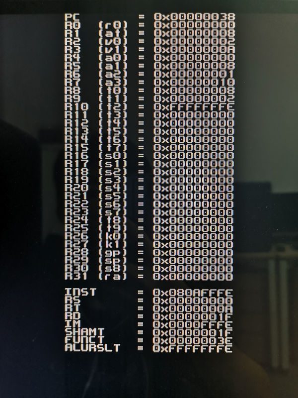

# Single-cycle MIPS CPU in verilog

This is one of the labs of Computer Organization Principle course at Sun-yat Sen University.

NOTE: This is NOT a standard MIPS implementation and is NOT compatible with any MIPS assemblers. The instructions are designed by professor
 and very different from those of standard MIPS code.

## Debug Screen

I have also written a debug screen outputting via VGA, so we can see the data in the registers directly.

